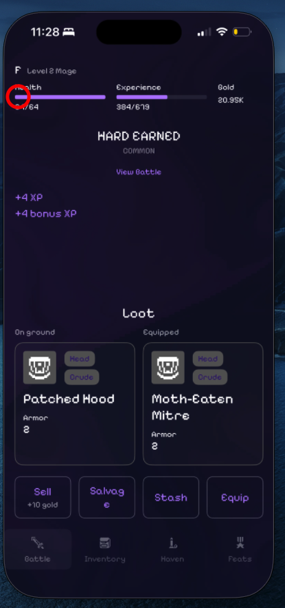
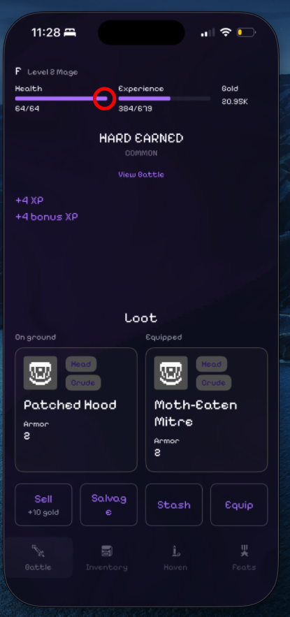
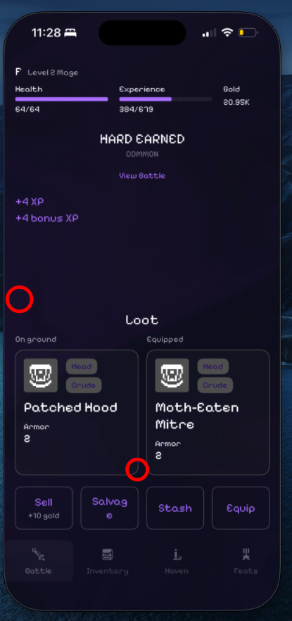
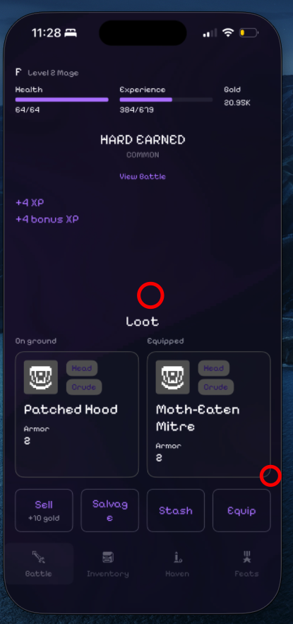

# void-clicker

Loot/health monitor and auto-triager for a roguelike played through iPhone
Mirroring. It watches the screen, and once a dropped item's rarity is
confirmed, clicks the corresponding sell/salvage/stash button. "Manual"
rarities (currently eldritch) and unrecognized drops are never clicked --
left for you to handle by hand.

## Setup (one-time)

```
pip3 install pyautogui mss numpy pynput
```

Grant Terminal (or your IDE) access under:

- System Settings > Privacy & Security > Accessibility
- System Settings > Privacy & Security > Screen Recording
- System Settings > Privacy & Security > Input Monitoring (needed for
  `calibrate`'s click detection, separate from Accessibility)

## Before running (any mode)

- The iPhone Mirroring app must already be running and open -- this script
  only reads/clicks pixels on screen, it doesn't launch or control Mirroring
  itself.
- Position the Mirroring window in the **top-left corner of the screen**,
  and leave it there. All pixel locations are absolute screen coordinates,
  so if the window moves, everything calibrated against it goes stale.
- In the Mirroring app, go to **View > Larger** to make everything bigger
  and easier to hit reliably.
- In-game, set **Loot Safety Timer Duration to Disabled** -- otherwise the
  timer can fire in the middle of a loot action and throw things off.
  `Eldritch & 5 seconds` is a possible alternative if you want the timer on
  for eldritch drops specifically, but that combination hasn't been tested.

## Known limitations

- `auto`/`live --close-dialogs` can detect and close dialogs that dim the
  screen and have a purple-text close button matching `DIALOG_CLOSE_BUTTON_COLOR`
  (level-ups, confirmations, etc.), but only checks once per cycle (before
  attacking) -- not mid-poll while waiting on something else. Anything
  outside that pattern still isn't handled automatically, so it still can't
  run fully unmonitored -- stay close enough to handle anything unexpected.

## Calibration

Pixel locations are machine/screen-specific, so they're kept out of the
script and live in a local `.env` file instead. Generate them by running:

```
python3 main.py calibrate
```

It walks you through clicking each of the following spots in order. For the
two health points, it also shows the color it read and whether that matched
the expected "good" color -- if it doesn't match, it'll ask you to click
that same point again.

It can be helpful to run the Digital Color Meter app while doing this
calibration. It will provide a zoomed-in view of the pixel locations. The
program expects the locations to be solid colors - it can be easy to get an
aliased pixel which would provide an invalid reading location.

1. **Health point** -- a pixel on the main health bar.

   

2. **Max health checkpoint** -- a point further along the health bar, at
   roughly the 95% mark. Used to tell "good tier" apart from "actually near
   max" (see `REQUIRE_MAX_HEALTH` below).

   

3. **Drop region top-left corner** -- the item box is anchored to the
   bottom and grows upward with more stats, so this and the next point mark
   the max bounds the box (and its icon) can ever occupy.

   

4. **Drop region bottom-right corner** -- see the bounds above.

5. **Equipped region top-left corner** -- same idea, for the box comparing
   against your currently equipped item.

   

6. **Equipped region bottom-right corner** -- see the bounds above.

7. **Sell button**

   <!-- TODO: screenshot of the sell button -->

8. **Salvage button**

   <!-- TODO: screenshot of the salvage button -->

9. **Stash button**

   <!-- TODO: screenshot of the stash button -->

10. **Tab bar icon, twice** -- the bottom tab bar icons are bright/white
    when the game is ready for you to attack, and dimmed while an item is
    on screen. This is an unambiguous, rarity-independent signal for which
    phase the game is in, so it's used to confirm attack/action taps instead
    of relying on the item box's own (rarity-dependent) colors. Click the
    **same spot** on the tab bar once while ready to attack, then again
    while an item is dropped.

    The recommended location for this is the flap of the backpack for the
    inventory icon.

    <!-- TODO: screenshot of the tab bar in both states -->

11. **Dialog close button region, twice** -- the close button on a dialog is
    horizontally centered but shifts vertically with the dialog's height, so
    instead of one point this needs the max bounds it could ever appear
    within. Open the **smallest** dialog you can for the top-left corner,
    and the **largest/tallest** dialog you can for the bottom-right corner.

    <!-- TODO: screenshot of a small and a large dialog with the close button marked -->

This writes `HEALTH_POINT`, `MAX_HEALTH_POINT`, `DROP_REGION`,
`EQUIPPED_REGION`, `SELL_BUTTON_LOCATION`, `SALVAGE_BUTTON_LOCATION`,
`STASH_BUTTON_LOCATION`, `TAB_BAR_POINT`, `TAB_BAR_READY_COLOR`,
`TAB_BAR_DROPPED_COLOR`, and `DIALOG_CLOSE_REGION` into `.env`, merging with
(not overwriting) whatever else is already there.

## `.env` reference

None of these have fallback values in the script -- if one's missing, the
script tells you which key and how to add it, then exits (except
`calibrate`, which doesn't need any of them to run).

| Key | Format | Example |
|---|---|---|
| `HEALTH_POINT` | `x,y` | `1955,194` |
| `MAX_HEALTH_POINT` | `x,y` | `2072,194` |
| `DROP_REGION` | `left,top,right,bottom` | `1947,472,2120,740` |
| `EQUIPPED_REGION` | `left,top,right,bottom` | `2133,472,2306,740` |
| `SELL_BUTTON_LOCATION` | `x,y` | `1986,783` |
| `SALVAGE_BUTTON_LOCATION` | `x,y` | `2120,789` |
| `STASH_BUTTON_LOCATION` | `x,y` | `2142,784` |
| `TAB_BAR_POINT` | `x,y` | `2000,900` |
| `TAB_BAR_READY_COLOR` | `r,g,b` | `255,255,255` |
| `TAB_BAR_DROPPED_COLOR` | `r,g,b` | `120,120,120` |
| `DIALOG_CLOSE_REGION` | `left,top,right,bottom` | `1900,900,2300,1200` |
| `ACTIONS` | `rarity:action,...` | `crude:sell,sturdy:salvage,enchanted:salvage,mythic:salvage,relic:stash,eldritch:manual` |
| `REQUIRE_MAX_HEALTH` | `true` or `false` | `false` |
| `INVENTORY_CAPACITY` | integer | `5` |
| `INVENTORY_USED` | integer, set to whatever's actually in your inventory when you start | `1` |

The first eleven are written by `calibrate`; the last four are hand-edited.

Rarity colors (`RARITY_COLORS`) and the tuning constants further down (tap
timing, match thresholds, etc.) stay in the CONFIG section of `main.py`
itself, since they're not machine-specific in the same way.

## Modes

```
python3 main.py calibrate                  # interactive: click each pixel location
python3 main.py auto                       # default mode: run the monitor/auto-triager
python3 main.py auto --timing              # like auto, but prints a per-cycle timing breakdown
python3 main.py auto --close-dialogs       # like auto, but auto-closes detected dialogs
python3 main.py live                       # same as auto, but for watching/tuning timing
python3 main.py live --no-click            # like live, but never taps -- you drive, it just verifies detection
python3 main.py live --close-dialogs       # like live, but auto-closes detected dialogs (ignored with --no-click)
python3 main.py debug                      # hover and print live cursor position + color
python3 main.py debug-drops                # live per-rarity match scores for drop/equipped
python3 main.py timing                     # benchmark actual screen-capture latency
```

Flags combine, e.g. `python3 main.py auto --timing --close-dialogs`.

`auto` and `live` both print the current `.env`-derived settings (actions,
inventory, require-max-health) first and wait for a keypress -- press Escape
to bail out and edit `.env` yourself, or any other key to start.

`live --no-click` is a safe way to sanity-check detection before trusting it
to click anything: it never taps, so you attack/sell/salvage/stash yourself
while it passively watches the tab bar and shows what it detected (drop,
equipped, suggested action) for each item -- compare that against what you
actually saw in-game.

`--close-dialogs` checks for an open dialog (via `HEALTH_POINT` reading as
dimmed) at the start of every cycle, before anything else -- everything
else reads as dimmed nonsense while a dialog covers the screen, so it has to
be handled first. If one's open, it searches `DIALOG_CLOSE_REGION` for the
close button's purple text and taps it, repeating (up to a few stacked
dialogs) until none remain. Verify detection first with `debug` (it shows
live `dialog open:` / `close button:` readings) before trusting this to
click anything.

`auto --timing` prints one line per cycle like:

```
cycle timing: dialog=0.00s healthy=0.00s attack=0.45s(6 polls) read=0.12s action=0.38s(5 polls) delay=0.05s total=1.00s
```

`healthy` is time spent waiting for `REQUIRE_MAX_HEALTH`/health-tier gating
(0 if already healthy), `attack` and `action` are the tap-and-confirm steps
(so they include any retries), `read` is the drop/equipped rarity read, and
`delay` is the fixed `ATTACK_DELAY` buffer. This is real timing from an
actual run (registration failures, retries, and all), not the synthetic
capture-only numbers from `timing` mode -- use it to see which step is
actually worth tightening. `attack`/`action` also report how many polls it
took to confirm: many polls means the tab bar genuinely takes that long to
settle (an animation, not something to optimize away), while few polls but
still slow time points at capture overhead instead.

`live` runs the exact same cycle logic as `auto` (same taps, same timing,
same real actions), but instead of the per-tap "tapping X at Y" logging and
a new status block scrolling by every cycle, it suppresses the tap logging
and rewrites a single status block in place. Meant for watching real cycle
timing without flooding the console while tightening up the timing
constants in the CONFIG section.
